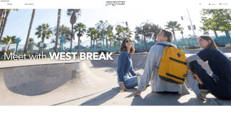
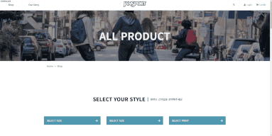
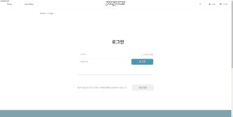
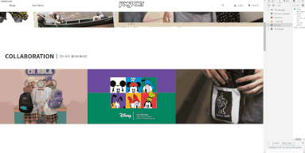

# 잔스포츠 리뉴얼

## 디자인 컨셉

청춘, 자유, 도전을 대변해온 브랜드인 잔스포츠의 사이트를 리뉴얼 하였습니다. 기존의 사이트는 메인 배너와 각 제품의 종류를 보여주는 섹션으로 구성된 단순한 구조였습니다. 이러한 단순한 구조를 가져가면서도 다양한 정보를 제공하기 위해 이미지 슬라이드를 적극 활용하였습니다. 또한 브랜드 컨셉 비디오를 풀 화면으로 배치하여 시각적 임팩트를 주었습니다.

## Pages

- index

경쾌하고 발랄하며 자유로운 브랜드 컨셉을 인덱스 페이지에 녹여내고자 하였습니다. 다른 서브 페이지와 다르게 화면을 100% 활용하는 디자인으로 심플하면서도 트렌디한 분위기를 연출하였습니다.

- sub1 production

제품 판매 페이지로 각 제품의 사이즈, 색상, 무늬를 선택할 수 있는 select 양식을 구현하였고 이미지에 마우스를 올리면 측면 방향의 가방이 보이도록 하였습니다.

- sub3 login

아이디와 비밀번호를 기입하여 로그인 할 수 있는 로그인 form을 구현하였습니다.

## 구현 기능

- 고정된 헤더 : 스크롤 하면 고정되는 헤더바를 만들어 사용자의 편의성을 높였습니다.
- 이미지 슬라이드 : swiper 플러그인을 활용하여 다양한 이미지 슬라이드를 구성하였습니다. 특히 콜라보레이션 섹션과 신제품 섹션의 슬라이드는 화면의 크기에 따라 슬라이드의 갯수가 변경 될 수 있도록 구성하여 어떤 화면 사이즈에서도 적절한 크기의 콘텐츠가 나올 수 있게 하였습니다.
- 드롭다운 메뉴를 통해 각 가방의 사이즈 , 색상, 무늬등을 선택할 수 있게 하였습니다.

## 반응형

데스크탑을 기준으로 디자인되었으며 1320px 이상, 1320px이하 ,1024px이하, 768px 이하를 분기로 반응형을 구현하였습니다..
